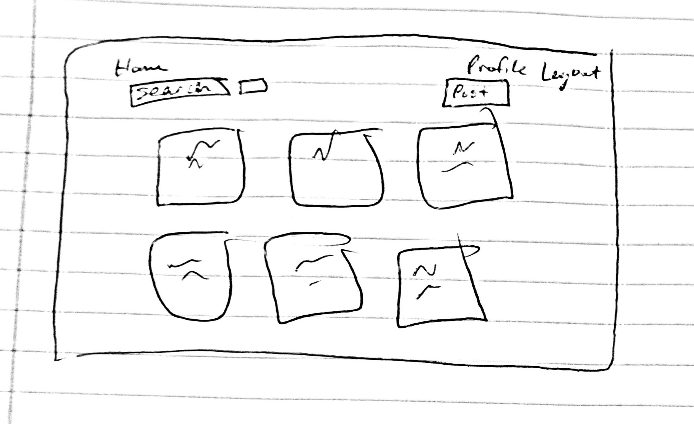
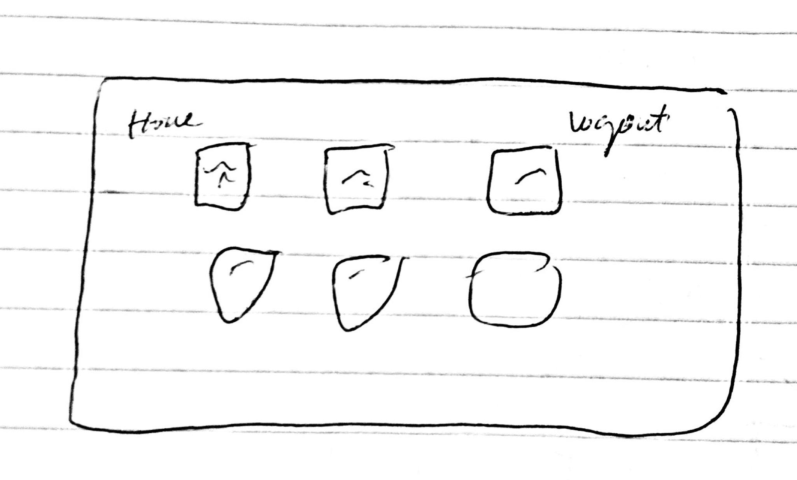
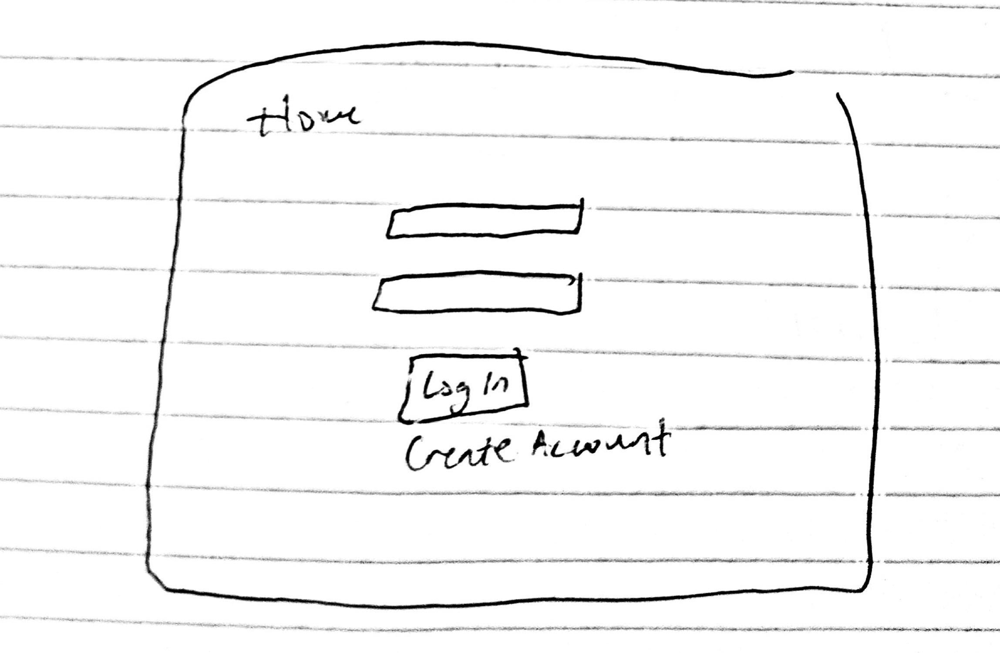
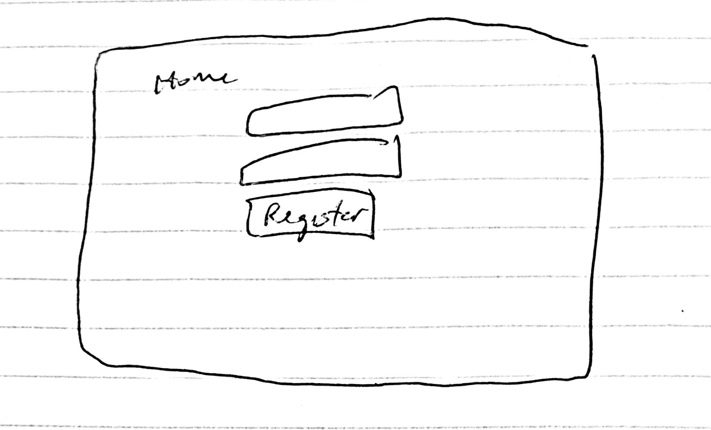
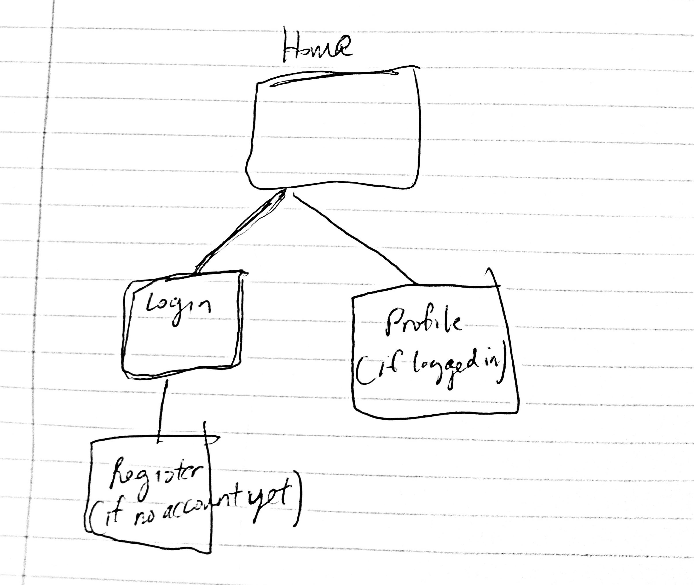

# Social Bulletin Board

## Overview

This web app is a "Social Bulletin Board", where users can post their thoughts as text onto the board. All posts are gathered on the homepage. Users can view posts and leave a reply in the comments. Users can register and login. Once they're logged in, they can start writing and replying to posts.


## Data Model

The application will store Users, Posts and Comments

* Users have an array containing their posts
* Each post has has an array containing its comments/replies (by embedding) and the username of whoever posted it
* Each comment references a Post and stores the username of whoever posted it

An Example User:

```javascript
{
  username: 'iluvanime',
  password: // password,
  posts: // an array of references to Post documents,
}
```

An Example Post with Embedded Comments:

```javascript
{
  createdAt: // when the post was created,
  text: // string content of post,
  numComments: // number of comments on the post,
  comments: [Comment] // array of Comment objects,
  user: // username of poster
}
```

An Example Comment:

```javascript
{
  text: // string content of comment,
  user: // username of poster,
  post: // reference to Post object,
  createdAt: // when the comment was created
}
```

## [Link to Commented First Draft Schema](db.js) 


## Wireframes

(___TODO__: wireframes for all of the pages on your site; they can be as simple as photos of drawings or you can use a tool like Balsamiq, Omnigraffle, etc._)

/ - home page, shows all posts



/profile - page that shows user's own info (posts submitted)



/login - page with a form that allows the user to log in


/register - page with a form that allows users to register


## Site map



## User Stories or Use Cases

1. As non-registered user, I can view posts and comments
2. As a non-registed user, I can register an account with the site
3. As a user, I can log in to the site
4. As a user, I can make a post and comment on other posts
5. As a user, I can view my own posts


## Research Topics

* (6 points) Integrate user authentication
    * Will use Passport for user authentication
* (2 points) Bootstrap
    * Will use Bootstrap CSS framework

8 points total


## [Link to Initial Main Project File](app.js) 

(___TODO__: create a skeleton Express application with a package.json, app.js, views folder, etc. ... and link to your initial app.js_)

## Annotations / References Used

1. 
2. 